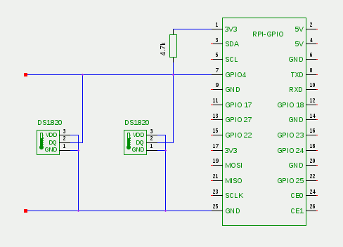

# Terrarium

This is a temperature control project for a chameleon terrarium.
The idea is that raspberry pi (3B) is reading out temperature from a DS1820 1-wire thermosensor. Based on the data
from this sensor it controls a heater in a terrarium. Apart from the heater, it also controls regular lights (UV)
and yet-to-be moisturizer. 

The controll of the accessories is performed via API calls to a [NETIO 4ALL](https://www.netio-products.com/cs/zarizeni/netio-4all) power socket.
All data will be exported via prometheus (both the controller app and the netio power socket (using my netio exporter)

## Temperature sensor

I am using a DS1820 sensor from [GME](https://www.gme.cz/teplotni-cidlo-s-kabelem-2-metry-flajzar-ds18b20-teplotni-cidlo#product-detail).
It has only 2 wires, parasitic connection scheme must be used.

The connection scheme used in my setup is taken from - https://www.mkompf.com/weather/pionewiremini.html




# Raspberry PI configuration
### Enable 1 Wire
To enable 1-Wire on RPi, the 1Wire must be enabled. Edit `/boot/config.txt` and add the following line:
```
dtoverlay=w1-gpio,gpiopin=x
```

The `gpiopin=x` is optional and defaults to PIN 4.

More info here:
- https://pinout.xyz/pinout/1_wire
- https://www.mkompf.com/weather/pionewiremini.html

My actual config is
```
dtoverlay=w1-gpio,pullup=on
```
as I use the default pin and use parasitic setup (the pullup=on is said to be required in https://www.mkompf.com/weather/pionewiremini.html)

After reboot, it just works :)
```
root@terra:~# lsmod | grep w1
w1_therm               28672  0
w1_gpio                16384  0
wire                   36864  2 w1_gpio,w1_therm

```


```
root@terra:~# cat /sys/bus/w1/devices/28-000009254ed9/temperature 
22750

```

# Reading temperature with Python
From the previsous section we can see that temperature can be easily read out from the file in `/sys/bus/w1`....
But for Python, there is a [lib](https://github.com/timofurrer/w1thermsensor) that can make that easier.

```
pip install w1thermsensor
```
```
In [1]: import w1thermsensor

In [2]: sensor = w1thermsensor.W1ThermSensor()

In [3]: sensor.get_available_sensors()
Out[3]: [W1ThermSensor(sensor_type=Sensor.DS18B20, sensor_id='000009254ed9')]

In [4]: sensor.get_temperature()
Out[4]: 21.6875
```

